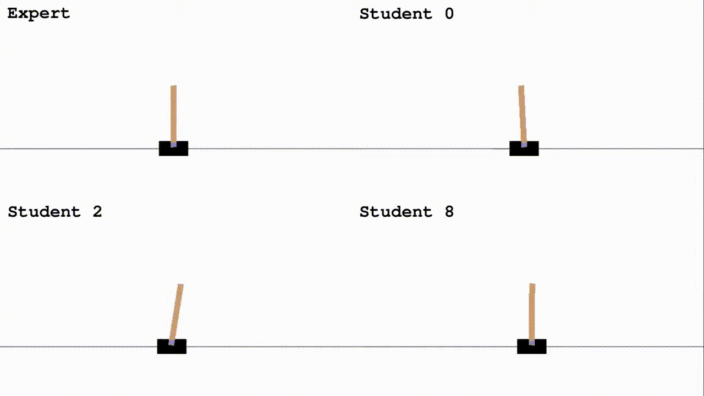

# Apprenticeship Learning with Inverse Reinforcement Learning

- [Apprenticeship Learning with Inverse Reinforcement Learning](#apprenticeship-learning-with-inverse-reinforcement-learning)
  - [Deep Q Implementation](#deep-q-implementation)
  - [Tabular Q Implementation](#tabular-q-implementation)
  - [Team Member](#team-member)

- This includes a double deep Q implementation (by [Daniel. D](https://github.com/DanielDworakowski)) and a tabular Q method (by [Richard H](https://github.com/rhklite)) of the paper [P. Abbeel and A. Y. Ng, “Apprenticeship Learning via Inverse Reinforcement Learning.](https://ai.stanford.edu/~ang/papers/icml04-apprentice.pdf) using CartPole model from openAI gym.

 

- [Apprenticeship Learning via Inverse Reinforcement Learning.pdf](Apprenticeship%20Learning%20via%20Inverse%20Reinforcement%20Learning.pdf) is the presentation slides
- [Apprenticeship_Inverse_Reinforcement_Learning.ipynb](Apprenticeship_Inverse_Reinforcement_Learning.ipynb) is the tabular Q implementation
- [linearq.py](linearq.py) is the deep Q implementation
- [Tabular Q Google Colab Version](https://colab.research.google.com/drive/1Tmc5fPHP9J0s-vQukLDzRywe47BNni37#scrollTo=bzxZCx5VD3xn)
  - Running the Code: 1. File → playground mode, or Copy to Drive to open a copy 2. shift + enter to run 1 cell. Run all the cells
  - Entire training takes around 10~15min

## [Deep Q Implementation](https://www.youtube.com/watch?v=COAyi4-VlEw)

DQN Performance

## [Tabular Q Implementation](https://www.youtube.com/watch?v=Wd1xfNNo9kc)

Tabular Q Performance

## Team Member

- [Daniel Dworakowski](https://github.com/DanielDworakowski/ALVIRL)
- [Omar Ismail](https://github.com/omarismail94)
- [Richard Hu](https://github.com/rhklite)
